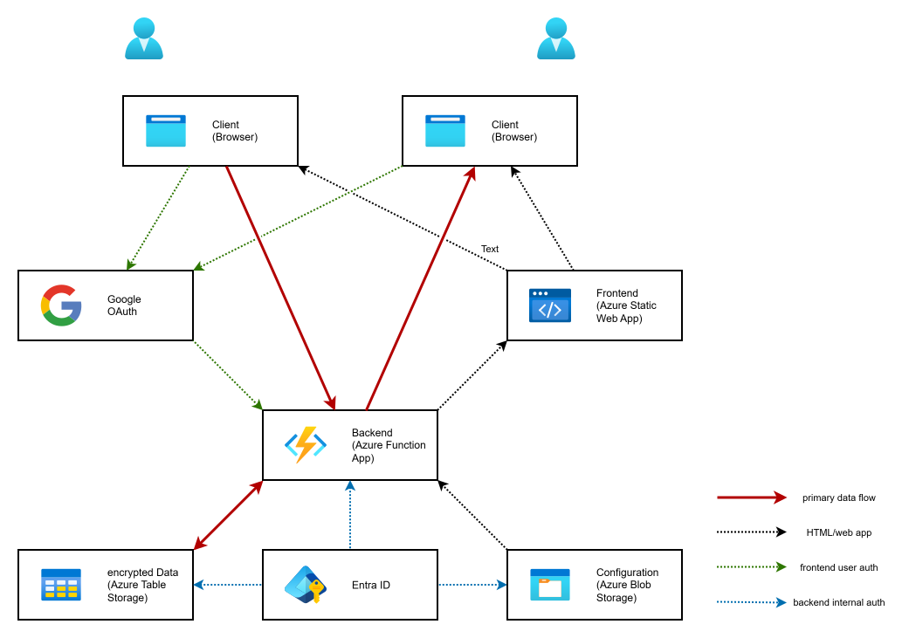

# YABAR: Yet Another Burn After Reading

## What is it

A tiny secret sharing tool that can run in low-cost cloud tiers. The repository
contains two independent application variants:

* Azure Static Web Apps + Azure Functions + Azure Storage Tables.
* Cloudflare Workers with static assets + D1.

The variants are intentionally separated for now. Shared code can be extracted
later after both deployment models are stable.

## Architecture



## Repository Layout

| Path | Purpose |
|------|---------|
| `azure/web` | Azure frontend application |
| `azure/frontend` | Azure Static Web Apps frontend config function |
| `azure/backend` | Azure Functions backend |
| `cloudflare` | Cloudflare Worker application and static assets, deploy scripts, and D1 migrations |
| `azure` | Azure OpenTofu/Terraform and deploy scripts |

## Manual Preparation: Github Actions

Set the `INFRA_TARGET` GitHub Actions variable to select what the deploy
workflow builds:

| Value | Description |
|-------|-------------|
| `azure` | Deploy only the Azure variant. This is also the default if unset. |
| `cloudflare` | Deploy only the Cloudflare variant. |
| `both` | Deploy both variants. |

### Github Action Secrets

| Name                 | Variant | Description                                           |
|----------------------|---------|-------------------------------------------------------|
| AUTH_GOOGLE_CLIENT_ID | Azure | Google Client ID used for the user side OAuth process |
| AZURE_CLIENT_ID | Azure | Azure app registration used for the Github workflow |
| AZURE_SUBSCRIPTION_ID | Azure | target Azure subscription |
| AZURE_TENANT_ID | Azure | target Azure tenant |
| CLOUDFLARE_API_TOKEN | Cloudflare | Cloudflare API token with Workers and D1 permissions |

### Github Action Variables

| Name | Variant | Description |
|------|---------|-------------|
| INFRA_TARGET | All | `azure`, `cloudflare`, or `both` |
| PROJECT_PREFIX | Azure | short name used for resource names |
| PROJECT_RESOURCE_GROUP | Azure | resource group where the app is deployed |
| TFSTATE_RESOURCE_GROUP | Azure | resource group where the tfstate storage is located |
| TFSTATE_STORAGE_ACCOUNT | Azure | storage account holding the tfstate container |
| CLOUDFLARE_ACCOUNT_ID | Cloudflare | Cloudflare account id |
| CLOUDFLARE_D1_DATABASE | Cloudflare | D1 database name; defaults to `yabar` in local scripts |

## Manual Preparation: Azure

### Terraform/Tofu

If you don't have one: create a storage account for the tfstate backend.

The Azure OpenTofu/Terraform configuration lives in `azure/tf`.

### Role Assignements

| Principal         | Role                                    | Scope                    |
|-------------------|-----------------------------------------|--------------------------|
| <AZURE_CLIENT_ID> | Terraform Resource Provider Registrar   | <AZURE_SUBSCRIPTION_ID>  |
| <AZURE_CLIENT_ID> | Reader                                  | <AZURE_SUBSCRIPTION_ID>  |
| <AZURE_CLIENT_ID> | Contributor                             | <PROJECT_RESOURCE_GROUP> |
| <AZURE_CLIENT_ID> | Role Based Access Control Administrator | <PROJECT_RESOURCE_GROUP> |
| <AZURE_CLIENT_ID> | Storage Blob Data Contributor           | <PROJECT_RESOURCE_GROUP> |

#### Role Definition: Terraform Resource Provider Registrar

```json
{
  "id": "/subscriptions/***/providers/Microsoft.Authorization/roleDefinitions/***",
  "properties": {
    "roleName": "Terraform Resource Provider Registrar",
    "description": "Allows the registration of Azure Resource Providers at the subscription scope.",
    "assignableScopes": [
      "/subscriptions/***"
    ],
    "permissions": [
      {
        "actions": [
          "Microsoft.Resources/subscriptions/providers/read",
          "*/register/action"
        ],
        "notActions": [],
        "dataActions": [],
        "notDataActions": []
      }
    ]
  }
}
```

## Manual Preparation: Google

1. Open [Google Cloud Console][google-cloud]
2. Create a project
3. Under [APIs and services][google-cloud-api] select [OAuth consent
   screen][google-cloud-auth]
4. Setup the general info for your project
5. Create a [Client][google-cloud-clients]
    *   For local testing with swa-cli add the authorised origin
        http://localhost:4280.
    *   For production enter the real URL of the deployed app.
    *   The client secret value is only required, if you test with Bruno or
        other API clients.

## Manual Preparation: Cloudflare

The Cloudflare variant is a separate application in `cloudflare`. One Worker
deployment contains the API and the static frontend assets from
`cloudflare/public`. It does not use Google GSI, `/api/config`, `/api/roles`,
bearer tokens, or in-app role handling.

Create these Cloudflare resources manually before the first deployment:

1. A D1 database bound to the Worker as `DB`.
2. A Cloudflare Access application/policy that protects the Worker endpoint or
   custom domain, including both the frontend and `/api/*`.

Update `cloudflare/wrangler.toml` with the real D1 `database_id` before
deploying. D1 migrations live in `cloudflare/d1/migrations`. The
deployment script applies them before deploying the Worker and its assets.

After verifying the unified Worker deployment, remove the previous Pages project
and its obsolete routing and Access configuration manually.

The Cloudflare cleanup job uses a Workers scheduled trigger. Cloudflare cron does
not run every second, so expired messages may remain until the next scheduled
cleanup run.

## F.A.Q.

### Why another such tool?

### Why is the backend a separate function app and not the function api provided by the static web app?

### How secure is it?

# Licenses

https://www.1001fonts.com/maytra-font.html

# Notes

https://www.bpb.de/themen/innere-sicherheit/dossier-innere-sicherheit/577732/quellen-telekommunikationsueberwachung-quellen-tkue/

https://netzpolitik.org/2021/catch-me-if-you-can-quellen-telekommunikationsueberwachung-zwischen-recht-und-technik/

----

[google-cloud]:         https://console.cloud.google.com/
[google-cloud-api]:     https://console.cloud.google.com/apis/dashboard
[google-cloud-auth]:    https://console.cloud.google.com/auth/overview
[google-cloud-clients]: https://console.cloud.google.com/auth/clients
